

<table>
  <tr>
    <td></td>
    <td></td>
  </tr>
  <tr>
    <td></td>
    <td></td>
  </tr>
</table>

# My Applications

  
🚥 Waybar layouts

   
  

    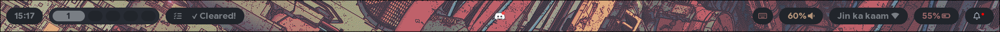
      
    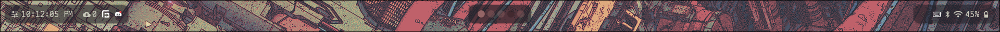
      
    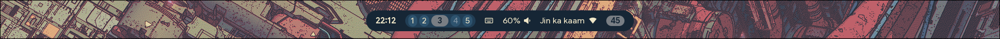
  

  
🛎 Swaync

   
  

    <table cellspacing="0" cellpadding="0" border="0" style="border-collapse: collapse; display: inline-table;">
      <tr>
        <td style="padding: 0px 5px;">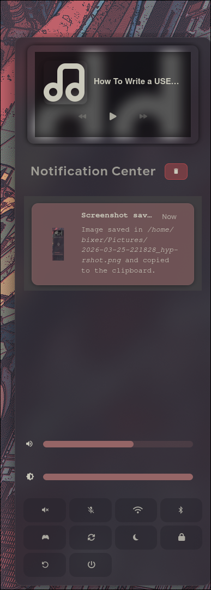</td>
        <td style="padding: 0px 5px;">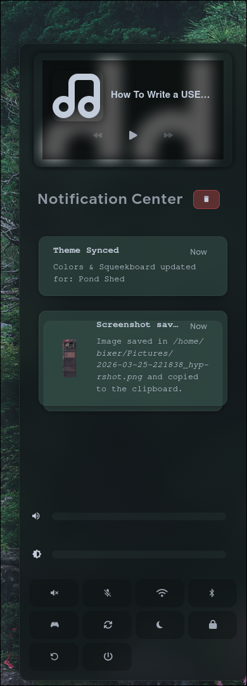</td>
        <td style="padding: 0px 5px;">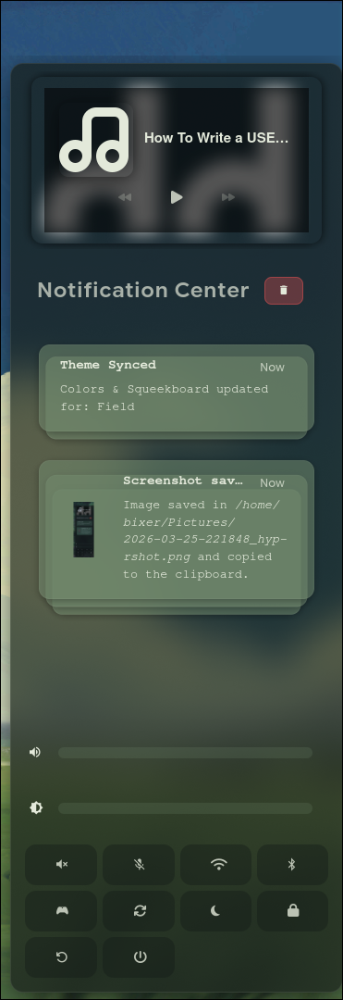</td>
        <td style="padding: 0px 5px;">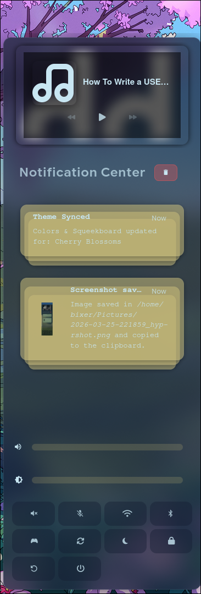</td>
      </tr>
    </table>
  

   

  
🔒 Hyprlock

   
  

    <table>
      <tr>
        <td>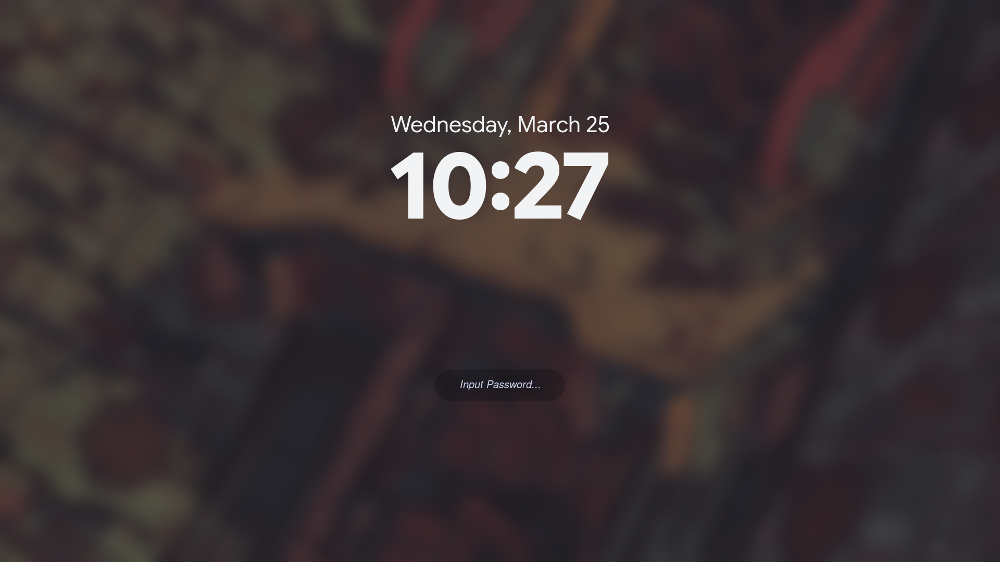</td>
        <td>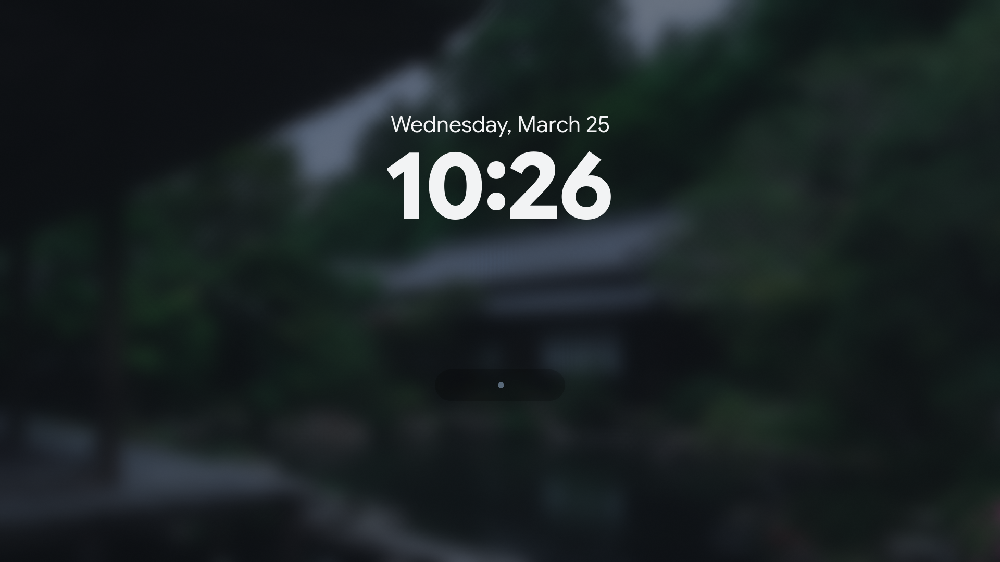</td>
      </tr>
      <tr>
        <td>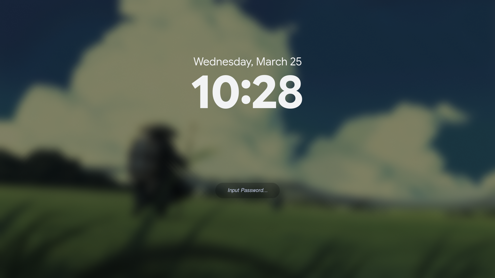</td>
        <td>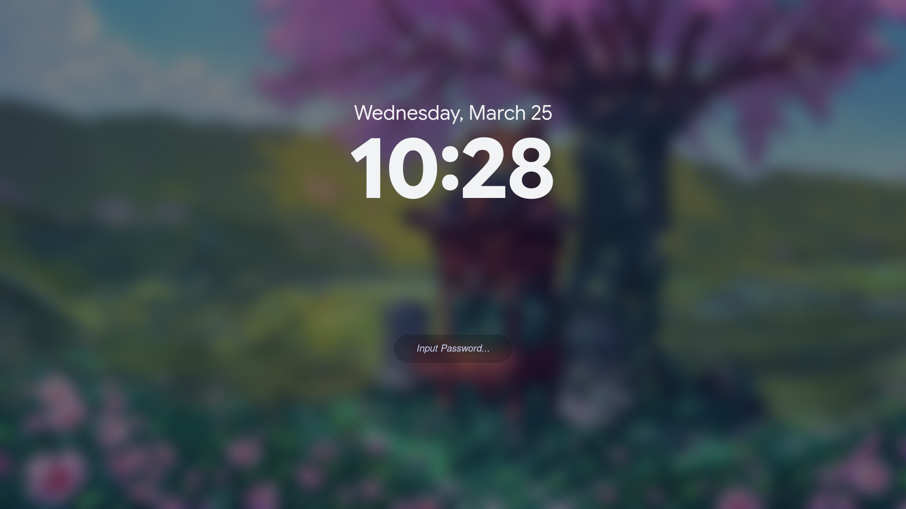</td>
      </tr>
    </table>
  

  
🖼️ Wallpaper & Waybar Switcher

   
  

    
<i>Theme switching logic powered by Matugen and Rofi</i>

    <table width="100%">
      <tr>
        <td width="50%" align="center">
          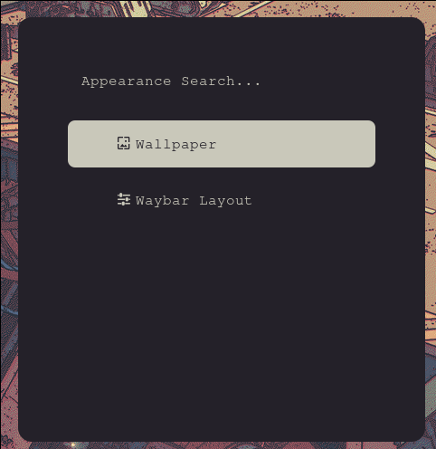
          
<b>Wallpapers</b>

        </td>
        <td width="50%" align="center">
          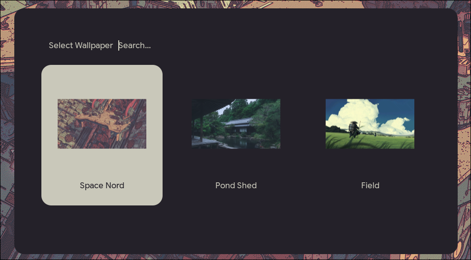
          
<b>Select Wallpaper</b>

        </td>
      </tr>
      <tr>
        <td width="50%" align="center">
          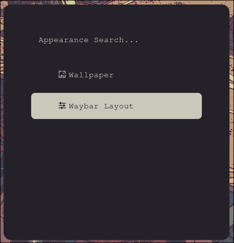
          
<b>Waybar Layout</b>

        </td>
        <td width="50%" align="center">
          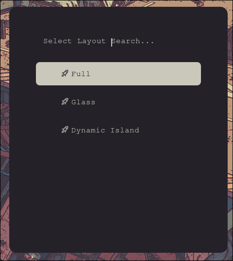
          
<b>Select Waybar Layout</b>

        </td>
      </tr>
    </table>
  

---

## 📝 Credits

*  — For technical inspiration and dots.
* **[elifouts](https://github.com/elifouts)** — For Swaync, Waybar, and inspiration for the GitHub repo.
* **[Typing SVG](https://github.com/DenverCoder1/readme-typing-svg)** — For the animated header.